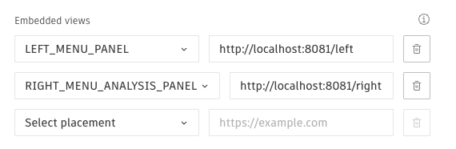

# Forma Extension Samples

This extension contains a sample of functionality that is possible when using the [Forma embedded view SDK](https://app.autodeskforma.com/forma-embedded-view-sdk/docs/index.html). Feel free to fork or clone this repo if you wish to use some
of its functionality or need a starting point for your extension.

If you wish to install the extension in your project, the unpublished extension ID `36d95978-5b68-43c5-bfcc-952f6a97fc90` is configured to be used with this sample extension running locally.

The extension exposes functionality in both the left panel, and the right side analysis panel.
You can also open the left side as a floating panel to get a feel for how that works as well.
If you find the functionality useful you can go directly to the source code by hovering the panel

The functionality is seperated by what we think is the fitting [placement](https://aps.autodesk.com/en/docs/forma/v1/embedded-views/introduction/) for different types of functionality.

## Run the extension from your own machine

If you want to run this extension from your own machine you will need to [create your own extension](https://aps.autodesk.com/en/docs/forma/v1/overview/getting-started/)

and make sure you have enabled both right and left panel in you configuration.



You also need to make sure your extension is installed in your project.

To start the extension, you'll need to install dependencies with:

```sh
npm install
```

and then run

```sh
npm start
```
