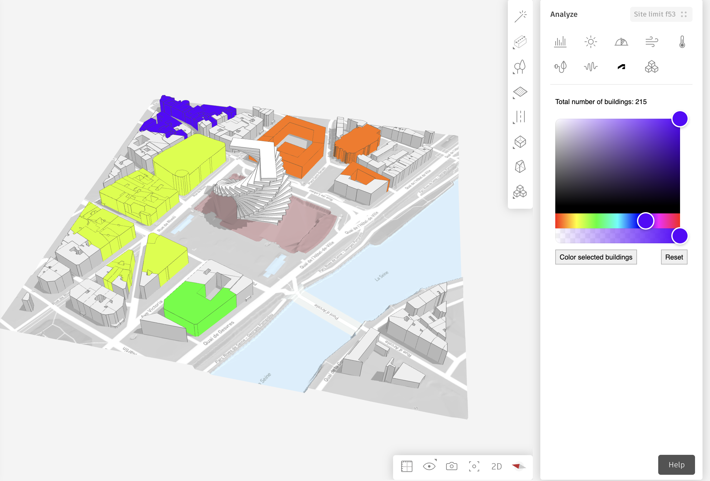

# This is an Autodesk Forma sandbox extension

This extension is built using the **[Forma SDK for Javascript](https://aps-dev.autodesk.com/en/docs/forma/v1/reference/embedded-view-sdk/)** using an `Embedded View` in the `Right hand side analysis panel`

**What it does:** Allow the user to select some buildings and change their color

## Illustration



## How was this built

The stack is built in a [vite](https://vitejs.dev/) + [preact](https://preactjs.com/)
framework to enable features which are typical in a modern web developers
toolbox.

### Local testing

In order to work with this extension locally, make sure you have the
[local testing extension](https://aps.autodesk.com/en/docs/forma/v1/developers_guide/local-testing-extension/)
for Forma installed. Install dependencies using

```shell
yarn install
```

and then you just need to run

```shell
yarn start
```
