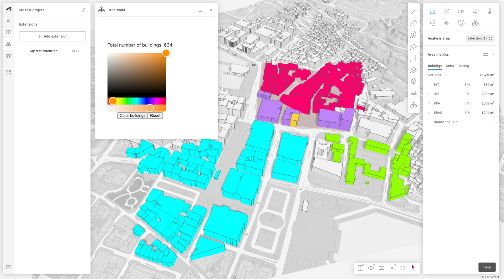

# This is an Autodesk Forma sandbox extension

This extension is built using the *
*[Forma SDK for Javascript](https://app.autodeskforma.com/forma-embedded-view-sdk/docs/)** using an `Embedded View` in
a `floating panel`.

[This tutorial](https://aps.autodesk.com/en/docs/forma/v1/embedded-views/tutorial/) describes step by step how this
extension was built.

**What it does:** Allow the user to select some buildings and change their color as illustrated below:



### How was this built

The stack is built in a [vite](https://vitejs.dev/) + [preact](https://preactjs.com/)
framework to enable features which are typical in a modern web developers
toolbox.

### Local testing

In order to work with this extension locally, make sure you follow the steps in the
[getting started guide](https://aps.autodesk.com/en/docs/forma/v1/embedded-views/getting-started/).

Then, install dependencies using

```shell
npm install
```

and run the extension with

```shell
npm run dev
```